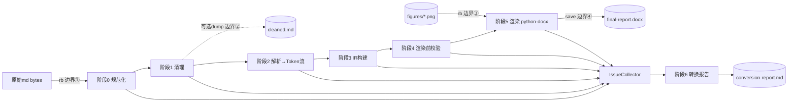

# 架构设计文档：Markdown 研究报告 → 格式规范 Word(.docx) 转换器 v2

> 设计者：SystemArchitect
> 输入依据：design-brief.md（含 D1-D14 预裁决）、tech_full.md、data_full.md、研究报告格式规范 V3.0、md-to-docx-pitfalls.md
> 状态：仅设计，不含实现代码（允许伪代码/接口签名示意）
> 交付定位：本文档定义总体架构；图表解析算法细则、OXML 精确规格、CLI/配置 schema、调度与报告细节由并行设计文档深化，本文档为其提供挂点与契约。

---

## 1. 架构概述

### 1.1 定位与模式

- **定位**：deep-research-report skill 阶段 9（定稿整合）的核心工具，独立 Python 包，输入 `research/drafts/final-report.md`（及 `research/figures/` 图片），输出符合 V3.0 格式规范的 `.docx` + 一份转换报告。
- **模式**：**全新构建（重写）**，不基于旧 `md2docx` 代码复用，但吸收其"配置驱动 + IR 中间表示 + renderer 按职责拆分"的已验证思路；docx 侧采用"从零 `Document()` 构建"路径（规避 tech_full.md 第16点 issue #686 的模板往返域破坏风险）。
- **运行形态**：单进程、单文档、一次性批处理管道。文档量级 90KB/约 500 行/9 图 6 表，无性能与流式处理诉求（data_full.md 存储约束结论），架构优先保证**确定性、可诊断性、防回归**，不做性能优化设计。

### 1.2 五条架构支柱（全部源自历史缺陷与预裁决）

| # | 支柱 | 对应决策/历史问题 |
|---|------|------------------|
| P1 | **文本域与渲染域物理隔离**：清理只发生在文本域（阶段1），渲染只发生在 docx 域（阶段5），中间隔着 IR。清理代码在数据类型上"看不见"渲染产物 | 问题8（清理误删渲染产物）→ 结构性不可能 |
| P2 | **数据驱动 IR，代码零内容硬编码**：图/表的编号、题注、文件路径 100% 在 IR 构建时从当前文档语法解析，IR schema 中不存在"默认题注/映射表"的容身之地 | D1、问题9、FIGURE_MAP 缺陷 |
| P3 | **单一触发点**：分页由 IR 中 PageBreak 元素唯一表达（唯一生成点 + 唯一消费点）；域代码由唯一构造函数产出；二进制 I/O 由唯一模块承担 | D5、问题1/2/3 |
| P4 | **两条独立题注路径**：图题注与表题注从解析、IR 装配到渲染是两条互不共享状态的路径 | 历史关键设计决策3 |
| P5 | **全程 Issue 收集，永不静默**：每个阶段向同一 IssueCollector 注入分级问题；任何"跳过/降级/自动修正"必须留痕于转换报告 | FIGURE_MAP"8图静默丢失"教训、D11/D12/D13 |

### 1.3 顶层数据流架构图

```
                        ┌──────────────────────────── 文 本 域 (str, LF-only) ────────────────────────────┐
原始 final-report.md    │                                                                                  │
(bytes: 可能 BOM/CRLF/  │  ┌─────────────┐   ┌─────────────┐   ┌─────────────┐                            │
 脏CR/任意编码问题)      │  │ 阶段0        │   │ 阶段1        │   │ 阶段2        │                            │
        │               │  │ 读取/规范化   │──▶│ 清理         │──▶│ 块/行内解析   │                            │
        └── rb 读取 ───▶│  │ Normalizer  │   │ Cleaner     │   │ Parser      │                            │
   【二进制安全边界①】    │  └─────────────┘   └──────┬──────┘   └──────┬──────┘                            │
                        │                           │(可选 dump)       │ Token 流                          │
                        └───────────────────────────┼─────────────────┼───────────────────────────────────┘
                                                    ▼                 ▼
                                     final-report-cleaned.md   ┌─────────────┐   ┌─────────────┐
                                     (调试用, wb 写出,          │ 阶段3        │   │ 阶段4        │
                                      非管道必经)        　　   │ IR 构建      │──▶│ 渲染前校验    │
                                    【二进制安全边界②】          │ IRBuilder   │   │ Validator   │
                                                              └──────┬──────┘   └──────┬──────┘
                        ┌──────────────── docx 域 (python-docx) ─────┼─────────────────┼──────────────────┐
                        │                                            ▼ DocumentIR      │ Issue 注入        │
                        │  ┌─────────────┐                    ┌─────────────┐          │                  │
     figures/*.png ────▶│  │ 图片文件      │───────────────────▶│ 阶段5        │          │                  │
     (rb 读取)          │  │ (rb 字节流)   │                    │ 渲染         │          │                  │
   【二进制安全边界③】    │  └─────────────┘                    │ Renderer    │          │                  │
                        │                                     └──────┬──────┘          │                  │
                        │                                            ▼ Document.save() │                  │
                        │                                     final-report.docx        │                  │
                        │                                    【二进制安全边界④:          │                  │
                        │                                     python-docx 内部UTF-8,    │                  │
                        │                                     天然安全(tech#13)】       │                  │
                        └────────────────────────────────────────────┼─────────────────┼──────────────────┘
                                                                     ▼                 ▼
                                                              ┌─────────────────────────────┐
                                                              │ 阶段6  后校验 + 转换报告        │
                                                              │ Reporter (消费 IssueCollector)│
                                                              └──────────────┬──────────────┘
                                                                             ▼
                                                    conversion-report.md (+ 控制台摘要, exit code 0/1/2)
```

Mermaid 等价图（供归档文档使用）：



---

## 2. 数据管道：阶段划分与输入输出契约

### 2.0 契约总表

| 阶段 | 名称 | 输入（类型） | 输出（类型） | 允许的副作用 | 禁止事项（契约负面面） |
|------|------|------------|------------|-------------|----------------------|
| 0 | 读取/规范化 | 文件路径 → `bytes` | `NormalizedText`（`str`，无 BOM，行尾统一 `\n`）+ `SourceMeta`（原始编码/行尾统计） | 无文件写入 | 不做任何内容性修改（只动 BOM/行尾/解码） |
| 1 | 清理 | `NormalizedText` | `CleanedText`（`str`）+ 清理动作 Issue（INFO/WARNING） | 可选 dump 中间 md（`wb`+`encode('utf-8')`） | **只删除/替换文本，不插入任何结构性标记**（分页补插不在此层，见 §5.1）；不解析 Markdown 结构；不接触图片文件 |
| 2 | 解析 | `CleanedText` | `list[Token]`（块级 Token 流，行内已解析为 InlineRun） | 无 | 不做语义判断（不区分"摘要章/正文章"、不关联题注、不解析图号）；不丢弃任何行（无法识别的行降级为段落 Token + WARNING） |
| 3 | IR 构建 | `list[Token]` | `DocumentIR`（见 §4） | 只读探测图片文件存在性（`os.path` 级，不读内容） | 不修改文本源；不触碰 python-docx |
| 4 | 渲染前校验 | `DocumentIR` | `DocumentIR`（原样透传）+ Issue | 无 | **只读不改**（D11：警告不改写）；唯一例外见 §2.4 密级兜底 |
| 5 | 渲染 | `DocumentIR` + `StyleSpec`（配置） | `Document` 对象 → `.docx` 文件 | 写 docx；`rb` 读图片字节流 | 不读 md 文本；不做正则清理；不推断/拼接题注与编号（只渲染 IR 现成字段）；除唯一消费点外不分页 |
| 6 | 后校验/报告 | `IssueCollector` + 产物路径 | `conversion-report.md` + 控制台摘要 + exit code | 写报告文件（`wb`+utf-8） | 不修改 docx |

**管道编排**：`pipeline.py` 顺序调用阶段 0→6，是唯一知道全部阶段的模块；各阶段模块彼此不 import（阶段间只通过上表中的数据类型通信）。FATAL 发生时短路至阶段 6（报告始终产出）。

### 2.1 阶段 0：读取/规范化（二进制安全边界①）

落实 D10 与 tech_full.md 第13/15点实测结论：

```python
# iotools.read_text_binary(path) —— 全项目唯一的文本读取入口（伪代码）
raw: bytes = open(path, 'rb').read()
raw = raw.removeprefix(b'\xef\xbb\xbf')          # strip BOM
raw = raw.replace(b'\r\n', b'\n').replace(b'\r', b'\n')  # CRLF/孤立CR → LF
text: str = raw.decode('utf-8')                   # 失败 → FATAL(E-IO-002)
```

- data_full.md 实测当前样本行尾 100% 规整（524 CRLF/0 孤立 CR），但本层作为**防御性常设逻辑**保留（问题1 的历史场景随时可能因 PowerShell 写文件复现），并把"原始行尾/BOM 统计"记入 SourceMeta 供报告输出。
- **硬约束**：除 `iotools` 模块外，任何模块出现 `open(`（不论模式）均为架构违规（反硬编码/反违规静态检查清单第 V-01 条，见 §9）。

### 2.2 阶段 1：清理（规则表驱动）

清理规则组织为**声明式规则表**（有序的 `(rule_id, 编译正则, 动作, 分级)` 列表），逐条执行并按命中次数生成 Issue，杜绝散落在函数体各处的匿名正则：

| 规则组 | 覆盖内容 | 来源 |
|--------|---------|------|
| CL-HTML | HTML 标签/div 分页残留删除 | 问题5（样本 0 处，防御保留） |
| CL-PLACEHOLDER | `图表占位` 类占位文本 | 问题6 |
| CL-PRINTHINT | `（第X章完，建议印刷页数…）` | 问题7 |
| CL-REDTEAM | `[红队 R\d+ 已…]`、`[已修正：…]` 过程标记剥离 | **D12（新增，样本实测 13 处）** |
| CL-SECRECY | 密级字样（绝密/机密/秘密/内部资料/内部参考/限内部使用…）检测+过滤，每次命中 WARNING | D13（防御性，样本 0 处） |
| CL-LISTFIG | 列表化图引用 `- 图X-Y：…` 前缀剥离 | 问题8 修复项之一 |

**注意**：旧管道中"剥离手动标题编号""删除 `---`""插入分页 `---`"三项**不再属于清理阶段**——编号剥离移入阶段 3 标题装配（需要语义上下文判断 H2 三类，纯文本正则无法安全区分），`---` 的消费与分页规划移入阶段 3 分页规划器（见 §5.1）。清理阶段的正则不允许含 `^#` 标题模式（负面清单，防止清理与标题语义逻辑再度纠缠）。

### 2.3 阶段 2：解析（详见 §8 技术选型）

行级块解析状态机，输出扁平 Token 流。Token 类型闭集：

```
MetaLine | HeadingToken(level, raw_text) | ParagraphToken(inline_runs)
| TableRowToken(cells) | ImageToken(alt_raw, path_raw) | HrToken
| OrderedItemToken / UnorderedItemToken(inline_runs) | BlankToken
| QuoteToken(防御) | FencedCodeToken(防御)
```

行内解析（inline）输出 `InlineRun(text, bold, italic, code, superscript, link_url)` 列表。样本实测行内语法仅：加粗 111 处、整行斜体 4 处、行内代码 2 处、超链接 0 处（data_full.md §1.7）——行内解析器按此子集实现，未识别语法原样保留为纯文本 + WARNING（永不丢字）。

### 2.4 阶段 3/4：IR 构建与渲染前校验

阶段 3 是**全部语义决策的唯一发生地**（标题分类、编号重编、图表三元组解析、题注/来源行关联、分页/分节规划、交叉引用登记），输出见 §4。

阶段 4 校验项（只产 Issue 不改 IR）：图片文件存在性复核、图/表编号连续性与重复检测、"先见文后见图"顺序检测（D11，WARNING 级）、"下图/上表"残留检测、附录D 图表索引与实际图表一致性（若存在附录D 表）、密级字样 IR 层兜底扫描（清理层漏网 → **ERROR**，因 V3.0 为强制条款；此为 D13"检测+过滤+报告"中"检测"的第二道闸，过滤动作仍只在阶段 1 执行——若阶段 4 检出残留说明阶段 1 规则有缺口，宁可 ERROR 阻断合格判定也不在校验层偷偷改数据）。

### 2.5 二进制安全边界汇总（D10 落实图上①②③④）

| 边界 | 位置 | 规则 |
|------|------|------|
| ① | md 读入 | 唯一入口 `iotools.read_text_binary`：`rb` → BOM/行尾 → `decode('utf-8')` |
| ② | 中间 md dump / 转换报告写出 | 唯一出口 `iotools.write_text_binary`：`str.encode('utf-8')` → `wb`（内部换行保持 `\n`） |
| ③ | 图片读入 | 渲染层以 `rb` 字节流（`io.BytesIO`）交给 `add_picture`，不经任何文本路径 |
| ④ | docx 写出 | python-docx 内部 lxml UTF-8 序列化，实测天然安全（tech_full.md 第13点），无需干预 |
| 控制台 | print/日志 | 所有控制台输出经统一 `console_out()` 包装（内部 `sys.stdout.buffer.write` 或 errors='replace'），规避 cp936 下 emoji/生僻字 `UnicodeEncodeError`（tech_full.md 实测复现的新风险点） |

内部字符串一律 `str` + `\n`；`\r` 在阶段 0 之后不允许存在于任何数据结构（校验项 V-02）。

---

## 3. 模块划分与职责边界

### 3.1 包结构总览（22 个文件，5 个层组）

```
scripts/md2docx/
├── __main__.py                # python -m md2docx 入口
├── cli.py                     # 参数解析
├── config.py                  # StyleSpec + 行为开关（唯一常量之家）
├── pipeline.py                # 管道编排器（唯一知道全部阶段的模块）
├── issues.py                  # Issue/IssueCollector/分级定义
├── iotools.py                 # 二进制安全 I/O 唯一进出口
│
├── textstage/                 # ── 文本域（阶段0-2）──
│   ├── normalize.py           # 阶段0
│   ├── clean.py               # 阶段1（规则表驱动）
│   ├── parse.py               # 阶段2 块解析
│   └── inline.py              # 阶段2 行内解析
│
├── ir.py                      # ── IR 定义（纯数据，零逻辑）──
│
├── assemble/                  # ── IR 域（阶段3）──
│   ├── builder.py             # IRBuilder 总控（Token流 → DocumentIR）
│   ├── metadata.py            # 文档头元数据块装配
│   ├── headings.py            # 标题语义分类 + 编号剥离/重编
│   ├── figures.py             # FigureAssembler：图三元组动态解析（D1）
│   ├── tables.py              # TableAssembler：表题注/来源行关联（D1）
│   └── breaks.py              # 分页/分节规划器（PageBreak 唯一生成点, D5）
│
├── validate.py                # 阶段4 渲染前校验（只读 IR）
│
├── render/                    # ── docx 域（阶段5）──
│   ├── document.py            # Document 装配总控 + 分节 + PageBreak 唯一消费点
│   ├── styles.py              # 样式表构建（eastAsia 等 OXML 样式细节）
│   ├── oxml_helpers.py        # OXML 底层积木库（域/书签/边框/底纹/页码…）
│   ├── cover.py               # 封面
│   ├── toc.py                 # 目录（TOC 域）
│   ├── headings.py            # 标题段落渲染
│   ├── paragraphs.py          # 正文段落/行内 run 渲染
│   ├── figures.py             # 图 + 图题注渲染（独立路径A）
│   ├── tables.py              # 表 + 表题注 + 来源行渲染（独立路径B）
│   ├── lists.py               # 列表渲染
│   ├── headerfooter.py        # 页眉页脚/页码/分节属性
│   └── special.py             # 防御性特殊元素（引用块/趋势符号等）
│
└── report.py                  # 阶段6 转换报告生成
```

### 3.2 逐模块职责卡（含"不做什么"负面清单）

> 负面清单是防止历史问题8（职责越界互相踩脚）的关键防线，实现阶段的 code review 必须对照本表。

#### 基础设施组

| 模块 | 职责 | 输入 | 输出 | 依赖 | **不做什么** |
|------|------|------|------|------|-------------|
| `cli.py` | 命令行参数解析、路径归一化 | argv | `RunOptions` | config | 不执行任何转换逻辑；不读文件内容 |
| `config.py` | 样式度量常量（字号/边距/色值/宽度）、行为开关（附录分页/题注Tier/严格模式）、**结构语义关键词白名单**（见§9） | — | `StyleSpec`、`BehaviorFlags` | 无 | **不含任何具体报告的标题/题注/文件名/表头关键词**（反硬编码红线）；不含逻辑代码 |
| `pipeline.py` | 按序调度阶段0-6；FATAL 短路；汇总 exit code | RunOptions | exit code | 各阶段模块 | 不实现任何阶段内部逻辑；不直接操作文本/IR/docx |
| `issues.py` | Issue 数据类、分级枚举、IssueCollector | — | — | 无 | 不做打印/落盘（由 report.py 消费） |
| `iotools.py` | 二进制安全读写唯一进出口、`console_out()` | 路径/str | bytes/str | 无 | 不做内容解析；**全项目其他模块禁止出现 `open(`** |

#### 文本域组（阶段0-2）

| 模块 | 职责 | 输入 | 输出 | 依赖 | **不做什么** |
|------|------|------|------|------|-------------|
| `normalize.py` | BOM/行尾/解码规范化，SourceMeta 统计 | bytes | NormalizedText + SourceMeta | iotools, issues | 不改内容字符；不识别 Markdown |
| `clean.py` | 规则表驱动的文本清理（§2.2 六组规则） | NormalizedText | CleanedText | issues, (iotools 可选dump) | **不插入任何文本**；不剥离标题编号；不删除/插入 `---`；正则不得含 `^#` 标题模式；不读图片 |
| `parse.py` | 行级状态机 → 块 Token 流 | CleanedText | list[Token] | inline, issues | 不做语义分类；不解析图号/表号；不丢行（未识别→段落+WARNING） |
| `inline.py` | 加粗/斜体/行内代码/超链接/上标 → InlineRun | 行文本 | list[InlineRun] | issues | 不处理块级结构；未识别语法保留原文不删除 |

#### IR 域组（阶段3-4）

| 模块 | 职责 | 输入 | 输出 | 依赖 | **不做什么** |
|------|------|------|------|------|-------------|
| `ir.py` | 全部 IR dataclass 定义 | — | — | 无 | **零逻辑、零默认内容值**（题注/路径等内容字段一律无默认值，构造时必须显式提供——schema 层面封死硬编码兜底） |
| `assemble/builder.py` | Token 流游标推进；分派各 Assembler；产出 DocumentIR | list[Token] | DocumentIR | 同组各模块 | 不直接解析图/表/标题细节（分派给专职 Assembler） |
| `assemble/metadata.py` | 文档头 `**字段**：值` 块 → MetadataIR；"版本"字段二次拆分日期（允许为空） | Token 片段 | MetadataIR | issues | 不假设存在独立日期字段（data_full.md §1.3）；缺字段→WARNING+空值，不编造默认文案 |
| `assemble/headings.py` | H2 三分类（摘要/章/附录）+ H3/H4 归属；兼容式编号剥离；结构化重编（D3/D4） | HeadingToken 流 | list[HeadingIR] | issues | 不写"第一章"等显示文本到共享状态之外（display_number 只在 IR 字段）；不触发分页（分页归 breaks.py） |
| `assemble/figures.py` | **路径A**：`` → 图号/题注/路径三元组解析；路径按 md 所在目录解析；`.svg` 引用协商为同名 `.png`；存在性探测 | ImageToken | FigureIR | issues | **不含任何图号→文件/题注映射常量**；不读像素/DPI（D2/新坑：宽度由渲染层按配置强制）；不管表格 |
| `assemble/tables.py` | **路径B**：向前看关联 `**表X-Y 标题**` 题注行、向后看关联 `*数据来源：…*` 斜体行；正文表/附录表二分类 | TableRowToken 组 + 邻近段落 Token | TableIR | issues | **不含表头关键词→题注映射**；附录表缺题注不是错误（kind=APPENDIX, caption=None）；不管图片 |
| `assemble/breaks.py` | **PageBreak 唯一生成点**：消费 HrToken + 按规则补插（附录 H2 边界等）；SectionPlan 生成（封面/前置/正文分节） | Token 流位置信息 + HeadingIR | list 中就位的 PageBreakIR + SectionPlan | issues | 除本模块外全项目**任何位置不得创建 PageBreakIR**；不渲染 |
| `validate.py` | §2.4 全部校验项 | DocumentIR | Issue 若干 | issues | **只读不改 IR**；不修 docx；检出问题一律走 Issue，禁止自动改写（D11） |

#### docx 域组（阶段5）

| 模块 | 职责 | 输入 | 输出 | 依赖 | **不做什么** |
|------|------|------|------|------|-------------|
| `render/document.py` | 遍历 DocumentIR 分派渲染；按 SectionPlan 建节；**PageBreak 唯一消费点**（`add_page_break()` 全项目仅此一处调用） | DocumentIR + StyleSpec | Document → save | 同组各模块 | 不解析文本；不做编号/题注推断；不给标题样式叠加 `page_break_before`（tech#12"二选一不可叠加"） |
| `render/styles.py` | 一次性构建全部命名样式（含 eastAsia 手写、firstLineChars 双写）；样式存在性预校验（防 KeyError/ValueError，tech#16） | StyleSpec | 就绪的 styles 表 | oxml_helpers | 字号/字体数值不得内联在其他渲染模块（问题13 的结构性规避：度量只存在于 config→styles 一条通道） |
| `render/oxml_helpers.py` | OXML 积木：`make_field(instr)`（四态 begin→instrText→separate→result→end 一次封装，问题2）、书签对、pgNumType、pBdr、shd、tblBorders、tblHeader、超链接、firstLineChars | 参数 | OxmlElement | 无 | 不含业务语义（不知道"这是目录还是页码"）；**其他模块禁止手拼 `w:fldChar`** |
| `render/cover.py` | 封面渲染（数据全部来自 MetadataIR） | MetadataIR | 封面段落组 | styles | 不含默认标题/机构文案；**不标密**（D13）；不自行分页（封面后分页由 SectionPlan/PageBreakIR 表达） |
| `render/toc.py` | TOC 域（经 make_field） | SectionPlan | 目录域段落 | oxml_helpers | 不手写目录条目（V3.0 §10.1 禁止） |
| `render/headings.py` | HeadingIR → 带样式标题段落（display_number + text 拼装渲染） | HeadingIR | 段落 | styles | 不计算编号（IR 已算好）；不分页 |
| `render/paragraphs.py` | ParagraphIR/InlineRun → run 序列 | ParagraphIR | 段落 | styles | 不做正则清理（P1 隔离）；不识别图表引用 |
| `render/figures.py` | **路径A 渲染端**：图片字节流嵌入（强制显式 `width=Cm(config.figure_max_width_cm)`，绝不信任 PNG 自带尺寸）+ 图题注段落（图下方） | FigureIR | 图+题注段落 | styles, oxml_helpers, iotools | 不解析 alt 文本；缺文件时渲染占位框+已有 Issue（不静默跳过）；不管表 |
| `render/tables.py` | **路径B 渲染端**：题注（表上方）+ 表格（全框线/交替底纹/跨页表头/宽度90%等 OXML）+ 来源行（表下方） | TableIR | 题注+表+来源段落 | styles, oxml_helpers | 不推断题注（IR 为准，附录表无题注则不渲染题注行）；不管图 |
| `render/lists.py` | ListIR 渲染（样本仅 1 级，无嵌套） | ListIR | 段落组 | styles | 不构建 abstractNum 多级定义（D3：标题不走 numPr；列表用内置样式即可） |
| `render/headerfooter.py` | 按 SectionPlan 设置各节页眉（简称+底线 pBdr）/页脚（PAGE 域）/pgNumType/首节无页眉脚 | SectionPlan + StyleSpec | 节属性 | oxml_helpers | 不创建节（document.py 建节，此处只填充属性）；精确 OXML 规格遵循并行设计文档 |
| `render/special.py` | 防御性：引用块/趋势符号/定义框（样本 0 处，按配置开关，默认关闭特殊框） | 对应 IR | 段落 | styles, oxml_helpers | 默认不对"主张—证据—推理"做文本内容匹配套框（见 §11 新决策 N4） |

#### 报告组（阶段6）

| 模块 | 职责 | 输入 | 输出 | 依赖 | **不做什么** |
|------|------|------|------|------|-------------|
| `report.py` | IssueCollector → conversion-report.md + 控制台摘要 + exit code 判定；输出检查清单自动勾选（V3.0 §10.3 可自动化项） | IssueCollector, SourceMeta, 产物路径 | 报告文件 | iotools | 不修改 docx/md；报告字段细节由 WorkflowDesigner 文档定义，本模块只承接其 schema |

---

## 4. IR（中间表示）设计

### 4.1 设计原则

1. **纯数据、无逻辑、无默认内容值**：`ir.py` 只有 dataclass；凡"内容性"字段（题注、路径、标题文本、编号）一律**无默认值**，构造时必须由 Assembler 从文档解析结果显式传入——这使"硬编码兜底"在 schema 层面没有安放位置（P2/D1 的结构化落实）。
2. **语义化而非语法化**：IR 记录"这是第 3 章"而不是"这是 H2"；md 层级与 Word 样式的映射关系（md H2章 → Word Heading 1 样式）在 Assembler 决定、Renderer 只认语义 kind。
3. **每个 IR 元素携带 `source_line`（原始 md 行号）**：所有 Issue 可回溯到源行，服务转换报告。
4. **顶层为有序元素列表 + 三个登记表**（扁平列表足以表达本文档结构，样本无嵌套需求；登记表服务校验与交叉引用）。

### 4.2 顶层结构

```python
@dataclass
class DocumentIR:
    metadata: MetadataIR                 # 文档头元数据（供封面/页眉简称）
    elements: list[BlockIR]              # 有序正文元素流（含 PageBreakIR）
    section_plan: SectionPlan            # 分节规划（breaks.py 产出）
    figure_registry: dict[str, FigureIR]     # "1-1" → FigureIR（校验用索引，与 elements 同对象引用）
    table_registry: dict[str, TableIR]       # "2-1" → TableIR（仅含有编号的正文表）
    xref_registry: list[XRefMention]         # 正文图表提及登记（先文后图检测用）
```

### 4.3 元素类型枚举与字段 schema

`BlockIR = Heading | Paragraph | Figure | Table | ListBlock | PageBreak | Quote(防御)`
（**注意：不存在 HorizontalRule 类型**——`---` 在阶段 3 已被 breaks.py 消费，渲染器的分派字典中没有 HR 分支，"分隔线被当作内容渲染/多处触发分页"在类型系统上不可能。）

```python
class HeadingKind(Enum):
    MAIN_TITLE   # md H1 唯一 → 封面标题（不渲染为正文标题）
    ABSTRACT     # "摘要"/"执行摘要" H2 → 无编号，罗马页码节
    CHAPTER      # 正文章 H2 → "第X章"（中文数字）
    SECTION      # H3 → "X.Y"
    SUBSECTION   # H4 → "X.Y.Z"（样本 0 处，规范支持）
    APPENDIX     # "附录X：" H2 → 字母编号
    PLAIN        # 段落小标题（不编号不入目录）

@dataclass
class HeadingIR:
    kind: HeadingKind
    raw_text: str            # 剥离前原文（报告/审计用）
    text: str                # 剥离编号后的纯标题文字
    number: HeadingNumber    # 结构化编号：chapter_no:int | (ch,sec) | (ch,sec,sub) | appendix_letter:str | None
    display_number: str      # 渲染文本："第三章" / "3.1" / "附录A" / ""（Assembler 算好，Renderer 只拼接）
    source_line: int

@dataclass
class ParagraphIR:
    runs: list[InlineRun]    # InlineRun(text, bold, italic, code, superscript, link_url)
    source_line: int

@dataclass
class FigureIR:                       # ── 三元组 100% 动态解析（D1）──
    figure_id: str                    # "1-1"（来自 alt 正则捕获组）
    chapter_no: int                   # 1
    seq_no: int                       # 1
    caption_text: str                 # "研究框架总览：SSA能力闭环与竞争阵营映射"（图号后空格分隔的剩余全文；标题内部冒号原样保留）
    alt_raw: str                      # 完整 alt 原文（审计用）
    path_raw: str                     # md 中的原始相对路径 "../figures/1-1-….png"
    path_resolved: str                # 以 md 文件所在目录为基准解析出的绝对路径
    file_exists: bool                 # 阶段3 探测结果
    bookmark_name: str                # "fig_1_1"（D14 Tier2 预留，Tier1 不消费）
    source_line: int
    # 无 width/height 字段：宽度是渲染策略（config.figure_max_width_cm），不是文档数据

class TableKind(Enum):
    BODY      # 正文表：有 **表X-Y** 题注行（数据来源行可有可无）
    APPENDIX  # 附录表：无题注行、无来源行（data_full.md §1.5 两类惯例）

@dataclass
class TableIR:
    kind: TableKind
    table_id: str | None              # "2-1"；附录表为 None
    caption_text: str | None          # 题注行剥离 "表X-Y " 前缀后的标题；附录表 None
    source_note: str | None           # "*数据来源：…*" 剥离星号后的文本；无则 None
    header_cells: list[list[InlineRun]]
    body_rows: list[list[list[InlineRun]]]
    n_cols: int
    bookmark_name: str | None         # D14 Tier2 预留
    source_line: int

@dataclass
class ListBlockIR:
    ordered: bool
    items: list[list[InlineRun]]      # 样本仅 1 级，schema 不设嵌套（防御：嵌套输入降级平铺+WARNING）
    source_line: int

class BreakOrigin(Enum):
    EXPLICIT_HR      # 来自文档中的 ---
    AUTO_APPENDIX    # 附录 H2 边界自动补插
    AUTO_RULE        # 其他规则补插（保留枚举位）

@dataclass
class PageBreakIR:
    origin: BreakOrigin               # 报告中区分"文档自带 11 处 / 自动补插 3 处"
    source_line: int | None

@dataclass
class SectionPlan:                    # breaks.py 产出，headerfooter/document 消费
    sections: list[SectionSpec]
    # SectionSpec(kind: COVER|FRONT|BODY, page_num_fmt: none|lowerRoman|decimal,
    #             page_num_restart: bool, header_mode: none|title_short,
    #             start_element_index: int)
    # 默认三节：封面(无页眉脚) / 前置=摘要+目录(罗马) / 正文+附录(阿拉伯)
    # 数据驱动：若页眉页脚设计文档要求"目录页无页眉"而摘要有，只需在此加一节，渲染器零改动

@dataclass
class XRefMention:                    # 校验专用（阶段3 从段落文本登记，阶段4 消费）
    ref_id: str                       # "图1-1" / "表4-1"
    ref_type: str                     # figure | table
    mention_line: int
    style: str                        # "paren"（图X-Y） | "asshown"（如图X-Y所示） | "positional"（下图/上表, 违规）

@dataclass
class MetadataIR:
    title: str                        # H1 文本
    subtitle: str | None
    report_type: str | None
    organization: str | None
    version_raw: str | None           # "V1.0 | 2026年7月"
    version: str | None               # "V1.0"（二次拆分）
    date: str | None                  # "2026年7月"（二次拆分，允许 None——无独立日期字段是实测事实）
    title_short: str | None           # 页眉简称（来源策略由页眉设计文档定，架构上从 metadata/配置取，不硬编码）
```

### 4.4 图三元组解析契约（FigureAssembler，D1 核心）

```
输入语法（唯一信息源）:  
解析正则(格式而非内容):  alt  →  ^图(\d+)-(\d+)\s+(.+)$        # 以"图号后第一个空白"切分；
                                                              # 显式不用冒号切分（标题内含冒号，data §1.4）
                        path →  按 md 文件所在目录 resolve 为绝对路径
后缀协商:               引用 .svg 且存在同名 .png → 替换 + WARNING(W-IMG-020)
                        引用 .svg 且无 png       → ERROR(E-IMG-021) + 占位渲染
异常闭环(全部走 Issue, 零静默):
  alt 不匹配"图X-Y "格式  → 该图降级为"无编号插图"渲染 + WARNING（不猜测编号）
  文件不存在             → ERROR + 渲染占位框（框内显示 path_raw）
  图号重复               → ERROR（两处都渲染，报告指出冲突行号）
  编号不连续/与章号不符   → WARNING（不改写编号——编号是作者语义，转换器不越权重排图号）
```

表题注解析契约（TableAssembler）对称：题注行正则 `^\*\*表(\d+)-(\d+)\s+(.+)\*\*$`（向前看，中隔至多 1 空行）；来源行正则 `^\*数据来源[：:](.+)\*$`（向后看，中隔至多 1 空行）；两者都缺 → 归类 APPENDIX 表，**不是错误**。具体算法细则（回溯窗口、多表连排等边界）由图表解析专项设计深化，本契约为其边界。

---

## 5. 单一职责关键点落位

### 5.1 分页唯一触发点（D5 的架构落位）

**收敛点从旧方案的"文本层 `---` 标记"上移为"IR 层 PageBreakIR 元素"**（新决策 N1，见 §11）：

```
上游输入（多源）                 唯一生成点                    唯一消费点
─────────────────              ────────────────             ─────────────────
文档自带 --- (11处)  ──┐
附录B/C/D H2 边界    ──┼──▶  assemble/breaks.py       ──▶  render/document.py
  自动补插规则        ──┘     plan_breaks()                  遇 PageBreakIR →
（未来新规则也进这里）        （全项目唯一允许构造              doc.add_page_break()
                              PageBreakIR 的函数）          （全项目唯一调用点）
```

- 仍然是"单一触发机制"（D5 原则不变），但触发物从文本标记升级为类型化 IR 元素，收益：① 不需要"清理阶段改文本再重新解析"的二次往返；② 补插逻辑带语义上下文（知道自己在附录边界），origin 字段让报告能区分自带/补插；③ 渲染器分派字典中无 HrToken 分支，"`---` 被多处理解"在类型上不可能。
- 静态检查（§9 清单 V-03/V-04）：`grep -rn "PageBreakIR(" | grep -v breaks.py` 与 `grep -rn "add_page_break" | grep -v document.py` 必须为空。
- 标题样式**不设** `page_break_before`（tech#12：与显式分页二选一，不可叠加，否则重演问题3 空白页）。
- 封面之后的分页不再是 cover.py 的私有动作：封面独占 SectionPlan 第一节，节边界天然换页（分节符语义），cover.py 不调用任何分页 API。
- 附录分页默认策略：**每个附录 H2 独立起页**（AUTO_APPENDIX 补插附录B/C/D 前共 3 处），提供开关 `appendix_page_break: bool = True`——样本中附录间无 `---` 判定为写作遗漏而非排版意图（V3.0 §一"每一章都从新的一页开始"+附录字母编号并列的排版惯例），保留开关以兼容"附录连排"的旧样式（数据基线报告"单样本不外推"的建议）。

### 5.2 图题注与表题注两条独立路径（历史决策3 的架构归属）

| | 路径A：图 | 路径B：表 |
|---|---|---|
| 信息源 | `` alt 文本 + URL | `**表X-Y 标题**` 加粗行 + `*数据来源*` 斜体行 |
| 装配模块 | `assemble/figures.py` | `assemble/tables.py` |
| IR 类型 | FigureIR | TableIR |
| 渲染模块 | `render/figures.py`（题注在**图下方**） | `render/tables.py`（题注在**表上方**、来源在表下方） |
| 共享点 | 仅共享 `render/styles.py` 的题注字号样式与 `issues.py` | 同左 |

两条路径**无共享可变状态、无相互调用**；一侧算法演进（如表题注回溯窗口调整）不可能波及另一侧——这是对历史上"图题注逻辑修表、表题注逻辑修图"类联动回归的结构性隔离。

### 5.3 清理阶段与渲染阶段的严格隔离（问题8 的结构性根除）

- 清理（阶段1）操作对象是 `str`，渲染（阶段5）操作对象是 `Document`，二者之间隔着 Token 流与 IR 两层，**时间上先后、类型上不同、模块上不互相 import**（clean.py 的 import 列表中不允许出现 render/*，反之亦然——检查项 V-05）。
- 历史问题8 的具体形态"embed_images Phase 3 清理逻辑把刚嵌入的题注也删了"，根因是清理与嵌入在同一文本文件上多趟往返。新架构中题注只存在于 IR/docx 域，清理正则运行时题注尚未"存在"，物理上无从误删。
- 中间产物 `final-report-cleaned.md` 从"管道必经文件"降级为"可选调试 dump"（`--dump-intermediate`），管道内存直通，消除"磁盘中间文件与内存状态不一致"这一整类错误（新决策 N2）。

---

## 6. 错误处理框架

### 6.1 分级与处理策略

| 级别 | 定义 | 处理策略 | 典型场景 |
|------|------|---------|---------|
| **FATAL** | 无法产出有意义的 docx | 中断管道 → 跳到阶段6 出报告 → exit code 2 | 输入文件不存在/UTF-8 解码失败/无 H1 主标题/IR 构建崩溃 |
| **ERROR** | 能继续，但产物某局部不合规 | 该元素降级/占位渲染 + 记录 → 继续 → exit code 1；`--strict` 下升级为中断 | 图文件缺失、表行列数不一致、密级字样阶段4仍检出、图号重复 |
| **WARNING** | 产物完整但质量存疑 | 记录，不干预内容（D11） | 先文后图违规、图编号不连续、附录表无题注（预期内仅 INFO，正文表无题注才 WARNING）、.svg→.png 协商替换、未识别行内语法 |
| **INFO** | 正常处置的留痕 | 记录 | 剥离标题编号 45 处、清理红队标记 13 处、自动补插分页 3 处、行尾规范化统计 |

原则：**任何自动决策（跳过/降级/替换/补插）至少留一条 Issue**——FIGURE_MAP 缺陷的教训不是"映射错了"，而是"错了没人知道"；本框架把"静默"本身定义为架构违规。

### 6.2 Issue 数据结构骨架（细节归 WorkflowDesigner，此处定架构位置）

```python
@dataclass
class Issue:
    level: Level              # FATAL/ERROR/WARNING/INFO
    code: str                 # 稳定编码，如 E-IMG-021 / W-XREF-001 / I-CLEAN-012（分类前缀由 Workflow 设计定稿）
    stage: str                # normalize/clean/parse/assemble/validate/render/report
    message: str              # 人读描述（中文）
    source_line: int | None   # 回溯到原始 md 行号
    element_ref: str | None   # "图2-2" / "表4-1" / "H2:第三章"
    suggestion: str | None    # 修复建议（如"请确认 figures 目录下存在该文件"）
```

- `IssueCollector` 由 `pipeline.py` 创建，作为显式参数传入每个阶段（不用全局单例——保证可测试性与阶段归属清晰）。
- 转换报告（阶段6）分区骨架：① 结论行（成功/带错误/失败 + exit code）② FATAL/ERROR 明细 ③ WARNING 明细 ④ 自动处置台账（INFO 聚合统计）⑤ V3.0 §10.3 输出检查清单自动勾选结果（可自动判定项打勾，需人工项标"待人工"，如"打开后按 F9 更新域"）。报告文件的完整 schema、控制台摘要格式、检查清单逐项映射由 WorkflowDesigner 文档定义。
- exit code 契约：`0` 成功（允许 WARNING/INFO）；`1` 完成但含 ERROR；`2` FATAL 未完成。

---

## 7. 架构级历史缺陷规避对照表（13 问题 + FIGURE_MAP 新缺陷）

| # | 历史问题 | 架构规避手段 | 为何"结构上不可能"再发生 |
|---|---------|-------------|------------------------|
| 1 | 标题截断（行中脏 CR + 文本模式二次转换） | 边界①②唯一二进制 I/O 模块（§2.5）；阶段0后全管道禁 `\r` | 除 iotools 外无 `open(` 调用（静态检查 V-01）；正则永远运行在 LF-only 字符串上 |
| 2 | TOC 域缺 separate 不被识别 | `oxml_helpers.make_field()` 唯一域构造函数，四态结构一次封装 | 其他模块禁止手拼 `w:fldChar`（V-06）；写对一次，处处正确 |
| 3 | 分页符多处触发/空白页 | PageBreakIR 唯一生成点+唯一消费点（§5.1）；标题样式不叠加 page_break_before | 类型系统中无 HR 元素可供渲染器"顺手"分页；生成/消费点 grep 可枚举（V-03/04） |
| 4 | 标题编号重复（手动+自动叠加） | 剥离与重编在 `assemble/headings.py` 同一模块原子完成（D4 兼容式）；渲染器只拼 `display_number + text`，无编号计算能力 | 编号只被计算一次、存储一处；渲染层没有"再加一遍编号"的代码路径 |
| 5 | HTML 标签残留 | clean.py 规则 CL-HTML + validate 残留复查 | 双闸；且规则表驱动使规则可枚举、可报告命中数 |
| 6 | 图表占位符未替换 | clean.py 规则 CL-PLACEHOLDER | 同上 |
| 7 | 印刷页数建议残留 | clean.py 规则 CL-PRINTHINT | 同上 |
| 8 | 清理逻辑误删渲染产物（题注） | 文本域/渲染域物理隔离（§5.3）；清理不插入内容、不再有"嵌入后再清理"的往返 | 清理运行时题注在类型上尚不存在（str 域里没有题注对象）；两域模块互不 import（V-05） |
| 9 | 表题注顺序硬编码→关键词硬编码 | TableAssembler 从 `**表X-Y**` 行动态解析（§4.4）；IR 无默认题注字段 | 代码里没有映射表的数据结构位置；反硬编码清单 H-02 静态扫描（§9） |
| 10 | 证据等级说明未独立起页 | breaks.py 统一分页规则（H2 边界规则化，无特例清单） | 分页规则集中一处，新增前置章节自动纳入同一规则 |
| 11 | 首章未从新页开始 | 同上：无 `first_chapter` 之类特例标志，所有章边界同一规则 | 规则无状态、对所有章一致，"跳过第一个"的旗标无处安放 |
| 12 | 封面排版要素缺失 | cover.py 专职模块，五要素全部来自 MetadataIR（动态解析文档头），缺失走 WARNING | 封面数据有 schema 约束；元数据解析失败会在报告中显式列出缺哪个字段 |
| 13 | 表体字号错误（12pt vs 10.5pt） | 全部度量常量唯一存于 config.py→styles.py 通道；渲染模块内联数值属违规（V-07） | 字号只定义一次；改一处全局生效，不存在"某个渲染函数私藏旧字号" |
| 14 | **FIGURE_MAP 纯硬编码字典→换文档 8 图静默丢失** | D1 全落实：FigureAssembler 三元组动态解析（§4.4）+ 零静默原则（§6.1）+ "换文档测试"验收门（§9 T-01） | ① 代码无字典可失配；② 即便文件缺失也必然产生 ERROR+占位框，"静默丢失"违反 Issue 强制留痕契约；③ IR 内容字段无默认值，没有"解析失败悄悄用兜底值"的路径 |

另收录两项**新发现坑**（不在 13+1 内，架构已覆盖）：
- **PNG 无 DPI/低 DPI 巨幅渲染**（data_full.md §2.2）：FigureIR 不含尺寸字段，render/figures.py 强制显式 `width=Cm(14)`（config 可调，≤14cm），架构上不存在"信任 PNG 自带尺寸"的代码路径。
- **cp936 控制台输出 UnicodeEncodeError**（tech_full.md #13）：`console_out()` 统一包装（§2.5）。

---

## 8. 技术选型落位

### 8.1 Markdown 解析：自研行级解析器 vs 第三方库

| 维度 | 自研行级解析器（推荐） | markdown-it-py (+mdit-py-plugins) | mistune |
|------|----------------------|-----------------------------------|---------|
| 语法覆盖需求 | 输入是受控子集：ATX 标题×4、段落、管道表格、图片行、`---`、1 级列表、加粗/斜体/行内代码——约 10 种块型，行级状态机 ~300 行（旧 parser.py 374 行已验证过 532 元素端到端） | 完整 CommonMark，远超需求；表格还需额外装 GFM 插件 | 覆盖够用 |
| 确定性/可控性 | 完全确定；每条规则自己写、自己测 | CommonMark 规则复杂：**`---` 紧邻上一文本行会被解析为 Setext H2**（样本前后有空行故安全，但这是随输入波动的隐性风险）；实体/转义处理是我们不需要的变换 | 版本间 API/行为波动有前科 |
| 依赖成本 | **零第三方依赖**（仅 python-docx），符合"纯本地、供应链最小"约束 | 引入 markdown-it-py + mdurl (+插件包)，需在两套 Python 环境安装维护 | 引入 1 个依赖 |
| Token→IR 距离 | Token 按本项目语义定制，一步到位 | 库 Token 是通用 AST，语义装配层（图号/题注/H2 三分类）一行都省不掉，还要写 Token 适配层 | 同左 |
| 失败模式 | 未识别行降级为段落+WARNING（自己定义，永不丢字） | 库内部决策，出错难归因到"我们的规则" | 同左 |

**推荐：自研行级块解析 + 受限行内解析**。决定性理由：① 输入是本 skill 自产的受控格式，语法子集封闭且已被 data_full.md 逐项实测枚举；② 语义装配（本项目 80% 的复杂度）无论选谁都要自研，库只省最薄的一层还引入 CommonMark 歧义（Setext 风险直击 `---` 这个最敏感的记号）；③ 零依赖消除双 Python 环境的安装漂移。**可替换性预留**：阶段2 的输出契约是本项目自定义 Token 流（§2.3），若未来输入语法扩张到失控，仅替换 parse.py/inline.py 为库适配层，IR 及以下全部不动。

### 8.2 其他选型落位

| 选型点 | 决定 | 理由/约束来源 |
|--------|------|--------------|
| docx 生成 | python-docx 1.2.0 + 15 项 OXML 手写（集中于 oxml_helpers/styles） | 简报既定；tech_full.md 汇总表逐项已实测可行 |
| 图片格式 | 仅 PNG；`.svg` 引用做同名 `.png` 协商（§4.4） | D2；SVG 实测 UnrecognizedImageError |
| 图片处理库 | **不引入 Pillow**：不读像素/DPI，只传显式 width，python-docx 按图片原生纵横比自动算高度 | 强制显式宽度策略使 DPI 元数据无关紧要；少一个依赖 |
| 外部进程 | **零 subprocess**：全部 Python 原生库操作 | 规避中文路径经 cp936 shell 传参的乱码风险（data_full.md §2.4） |
| 章节编号 | 编号写入文本 + Heading 样式控制视觉；不做 numPr/abstractNum | D3（记录为对 V3.0 §10.1 的显式变通）；同时规避 WPS chineseCounting 未决风险 |
| 图表题注/交叉引用 | **分级方案（D14 深化）**：Tier1（默认，必做）=题注编号写入文本，与 D3 章节编号策略同构，体系一致；Tier2（配置开关 `caption_field_mode`，默认关闭）=SEQ 域题注+书签+REF 交叉引用，IR 已预留 bookmark_name 字段，oxml_helpers 已备积木 | 章节编号已裁决写文本（D3），图表若独走域编号会形成"半域半文本"混合体系，且 WPS 域更新不可靠（tech#14）；Tier2 架构预留使未来升级不动 IR |
| TOC/PAGE 域 | 必做（make_field 四态）+ settings.xml `w:updateFields=true` + 报告中"F9 更新域"人工提示项 | D14 必做项；tech#3 域结果无法由 python-docx 计算，产品侧兜底提示 |
| 目标 Python | 3.11 与 3.14 双兼容（本机两套环境均装 python-docx 1.2.0）；不依赖 PEP 686（实测未启用） | tech_full.md 环境核验 |
| 配置形态 | config.py 常量 + CLI 开关两层（是否引入 YAML 配置文件由接口设计文档裁定；架构只约束：配置内容仅限度量/开关/格式正则，禁止内容性数据） | 反硬编码红线 |

---

## 9. 反硬编码机制与架构级检查清单

### 9.1 机制（三道防线）

1. **Schema 防线**：IR 内容字段无默认值（§4.1）——硬编码兜底在类型层无处安放。
2. **常量白名单防线**：config.py 是唯一常量之家，其允许内容为：样式度量、行为开关、**格式正则**（匹配 `图\d+-\d+` 这类**模式**）、**结构语义关键词白名单**（仅限：`摘要/执行摘要`、`附录`、`图`、`表`、`数据来源`、密级词表、红队标记模式、`第X章` 编号词——这些是**文档结构协议**的一部分，非具体报告内容）。区分标准：*换一份完全不同主题的报告，该字符串是否仍必须出现在代码里？是→结构关键词（允许）；否→内容硬编码（违规）*。
3. **静态扫描 + 验收测试防线**：见下清单。

### 9.2 架构级自查清单（实现阶段每次提交对照；编号供 CI/评审引用）

**违规静态检查（V 系列，grep 可执行）**
- [ ] V-01：`open(` 仅出现在 iotools.py
- [ ] V-02：阶段0 之后无任何 `\r` 处理逻辑散落（`'\r'` 字面量仅 normalize/iotools）
- [ ] V-03：`PageBreakIR(` 构造仅出现在 assemble/breaks.py
- [ ] V-04：`add_page_break` 调用仅出现在 render/document.py
- [ ] V-05：textstage/* 与 render/* 互不 import；clean.py 不 import assemble/*
- [ ] V-06：`w:fldChar` 字符串仅出现在 oxml_helpers.py
- [ ] V-07：`Pt(`/`Cm(` 数值字面量仅出现在 config.py / styles.py / oxml_helpers.py（渲染业务模块禁止内联度量）
- [ ] V-08：`page_break_before` 全项目 0 处（与 PageBreakIR 机制互斥）

**反硬编码检查（H 系列）**
- [ ] H-01：源码中不出现任何具体报告的标题文字片段（如"SSA""星图测控""研究框架总览"）
- [ ] H-02：不存在 `FIGURE_MAP`/`TBL_CAPS`/`TABLE_MATCHERS` 及任何"编号→题注/文件名"或"表头关键词→题注"的映射数据结构
- [ ] H-03：不出现 figures 目录下任何具体文件名
- [ ] H-04：config 中新增常量须通过 §9.1 防线2 的"换报告仍需存在"判据
- [ ] H-05：IR dataclass 内容字段无默认值（新增字段时复查）

**验收测试门（T 系列，细则由测试设计文档展开）**
- [ ] T-01：**换文档测试**——用第二份同语法、不同内容（不同图数/表数/章数/文件名）的 md 走全管道，图表题注/路径/编号必须全部来自新文档；任何图表丢失必须在报告中以 ERROR 可见
- [ ] T-02：无编号标题输入（剥离逻辑空转）与带编号输入产出一致
- [ ] T-03：脏输入回归（BOM/CRLF/行中 CR/密级字样/红队标记 注入样本）全部被处置且报告留痕

---

## 10. 与并行设计文档的接口挂点

| 并行设计主题 | 本架构提供的挂点 | 对方需回填的内容 |
|-------------|----------------|----------------|
| 图表映射解析算法细则 | §4.4 契约（正则骨架、异常闭环分级） | 回溯/前瞻窗口精确规则、多图连排/表后紧跟表等边界 case |
| 标题分类与编号细则 | HeadingKind 枚举 + headings.py 职责卡 | "第X章"中文数字集/  "X.Y" 变体的完整剥离正则组、无编号附录识别策略 |
| OXML 精确规格（TOC/双页码/页眉底线/表格线型） | oxml_helpers 积木清单 + SectionPlan 数据结构 | 各域 instrText 精确串、pgNumType 属性值、pBdr/tblBorders 的 sz/space/color 逐项数值、STYLEREF vs 固定简称的定稿 |
| CLI/配置 schema | cli.py/config.py 职责卡 + BehaviorFlags 开关清单（appendix_page_break / strict / dump-intermediate / caption_field_mode / figure_max_width_cm） | 参数名/默认值/是否引 YAML 定稿 |
| 转换报告与检查清单自动化 | §6.2 Issue 骨架 + 报告分区骨架 + exit code 契约 | Issue code 全集、报告模板、V3.0 §10.3 清单逐项的自动/人工判定映射 |
| 测试设计 | §9.2 T 系列门 | 测试矩阵展开 |

---

## 11. 新决策清单（需编排器注意；均为对 D1-D14 的细化或补位，无矛盾项）

| # | 新决策 | 与预裁决的关系 |
|---|--------|---------------|
| N1 | **分页收敛点从"文本层 `---` 标记"上移为"IR 层 PageBreakIR 元素"**：`---` 与附录边界自动补插都是其上游输入；清理阶段不再插入/删除 `---` | D5 的实现方式细化——"唯一触发机制"原则保持，触发物由文本标记升级为类型化 IR 元素；与 pitfalls.md"数据管道架构（正确版）"流程图存在差异，实现落地后需同步更新该文档 |
| N2 | 中间产物 `final-report-cleaned.md` 降级为可选调试 dump（`--dump-intermediate`），管道内存直通 | 补位决策；消除磁盘中间文件与内存状态不一致的整类错误；SKILL.md 阶段9 对中间产物的描述需随实现同步修订 |
| N3 | 附录分页默认**每附录独立起页**（AUTO_APPENDIX 补插 3 处），开关 `appendix_page_break=True` 可关 | D5 已裁决"自动补插"，此处明确默认值与可配置性 |
| N4 | "主张—证据—推理"段落**按普通段落渲染**（加粗 run 自然保留）；文本内容匹配套定义框的功能作为 special.py 可选配置且**默认关闭** | 确认简报问题清单第 10 项的建议方案；理由：样本无结构化标记，内容匹配触发渲染违反"格式与内容解耦"原则 |
| N5 | Markdown 解析选型定案：**自研行级解析器，零第三方解析依赖**（§8.1 对比） | 简报交由架构层裁定的选型点 |
| N6 | D14 分级方案定案：Tier1 题注编号写入文本（默认、必做）；Tier2 SEQ/REF/书签域题注为配置开关（默认关闭），IR 与 oxml_helpers 已做架构预留 | D14 要求设计层给出的分级方案；与 D3"编号写入文本"保持体系一致 |
| N7 | 图片侧新增 `.svg` 引用→同名 `.png` 协商规则（有则替换+WARNING，无则 ERROR+占位） | D2 的边界补全 |
| N8 | 零 subprocess、不引入 Pillow；控制台输出统一 `console_out()` 包装规避 cp936 | D10 的延伸补位（覆盖 tech_full.md 新发现的控制台编码风险） |
| N9 | exit code 契约：0=成功（可含 WARNING）/1=含 ERROR 完成/2=FATAL | 补位决策，供调度与 CI 消费 |

**与 D1-D14 无矛盾**；两处对上游文档的修订联动提请编排器登记：① pitfalls.md 管道图与"清理脚本插入 ---"的表述在实现后需更新（N1/N2 影响）；② V3.0 §5.2 "SVG 优先"与 §10.1"多级列表绑定/SEQ 域"两条款按 D2/D3/N6 记录为显式变通，建议在规范文档中加注（tech_full.md 对设计层提示第 1/2 条）。
